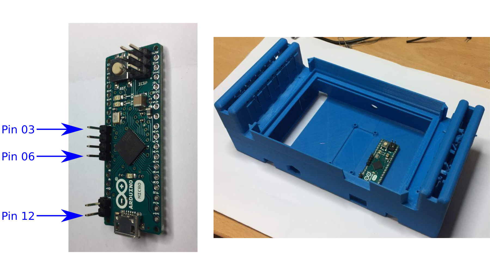
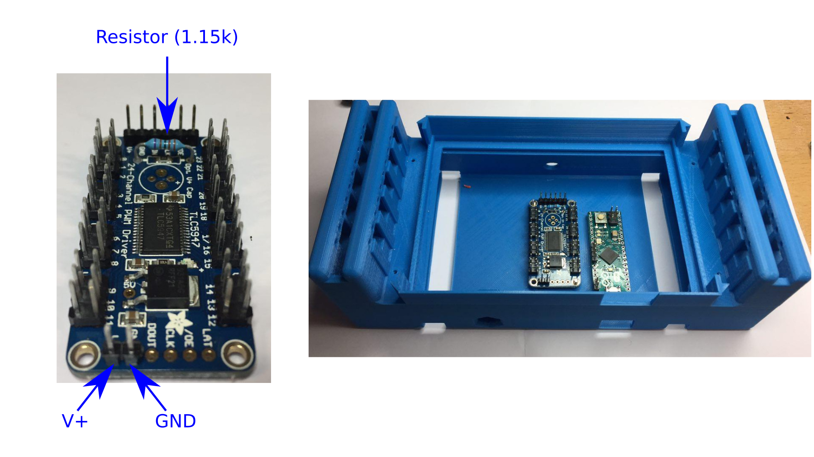
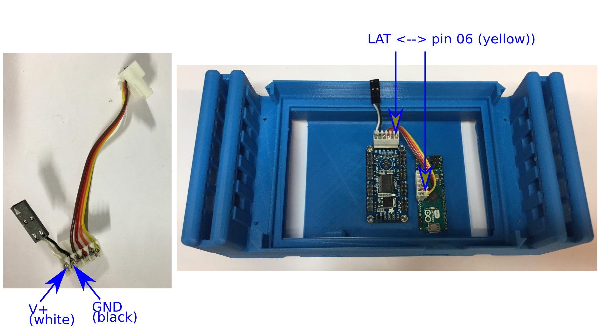
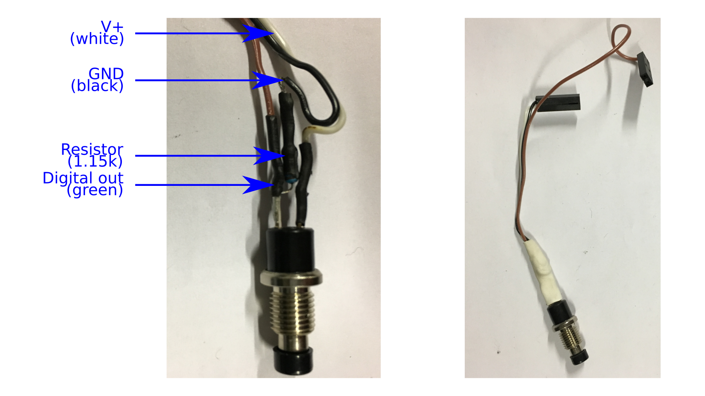
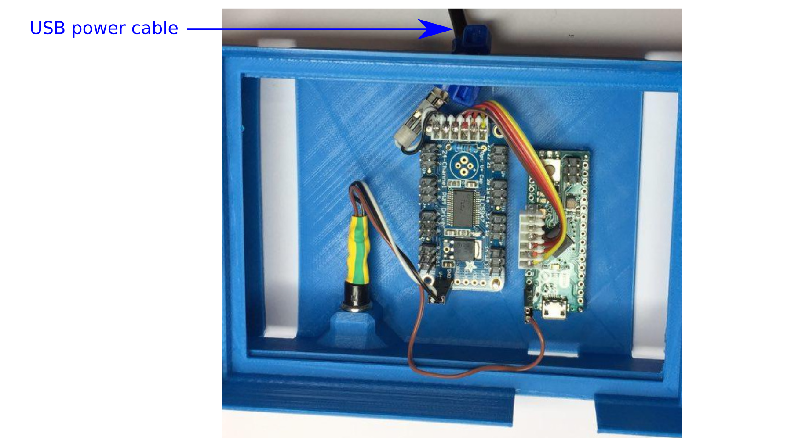

Optomotor Module
=========================


The optomotor is an ethoscope module that allows us to deliver both mechanical (tube rotation) and optical (LED) stimuli to fruit flies held in individual glass tubes.

The original onshape repository for the optomotors lives [here](https://cad.onshape.com/documents/3d4348ea20384ce925691583/w/6966f4288591c2cdd19df81a/e/ab72f28500a5d560744ab72b).

The assembled module will look like this:


[[pictures A (module), B module+ ethoscope]]


Conceptually, the module contains three distinct parts:

* "main", the mandatory components

* "opto", only needed for optical stimulus delivery

* "motor", only needed to rotate tubes


A list of components (BOM) for each part is available [here](BOM.csv).

In this document, we describe how to build both opto and motor parts.

Therefore, before we start, we have something like this:


[[picture overview]]


Main
-----------------------------------------------

The idea is to prepare two electronic boards : [Arduino micro](https://www.arduino.cc/en/Main/ArduinoBoardMicro) and [TLC5943](https://www.adafruit.com/product/1429,15), screw them to the bottom of the main box and connect them to each other.
Also, we add a push button for testing purposes.

###Trimming the main box

The main box is a large print with a lot of support, and it is easier to trim it before putting anything sensitive inside.
Importantly, if you intend to add motors, **ensure you remove all plastic from the cavity that will hold them**.
Indeed, a tiny bit of plastic could end up inside the bear box.


### Arduino board

This is the "master" board that processes input from the computer and coordinate the stimulus delivery.

 1. Solder a 4-pin header (cut a 6-pin header two, 4+2) between pins 3 and 6 (see picture below)

 2. Solder a 2-pin header between pins 11 and 12

 3. Screw the board in place using four 1.2mm diameter screws.

 4. Plug the USB micro cable to the board. Then compile and upload the firmware (you need some degree of familiarity with the Arduino [build process](https://www.arduino.cc/en/Hacking/BuildProcess) for that).
 The code for this firmware lives [here](https://github.com/gilestrolab/ethoscope_hardware/blob/master/modules/optomotor/optomotor.ino).





### TLC5943

This board is the "slave".
It is ultimately responsible of turning on/off components (LED/motors).


1. Solder all (i.e. 8) the 6x2 headers (see picture below)

2. Solder the 2 6x1 headers on both extremities of the board

3. Solder the 1.15kΩ resistor

4. Screw the board in place -- using the 2.6mm diameter screws





#### Board connector

The connections between the two above boards has to be very robust at all time.

To build the connector (picture below), we use **80mm** of **6-way** ribbon cable. Four of the wires connect the two boards, whilst two bring external power to the TLC5943.


1. Strip all six wires on one end only.

2. Squeeze each wire on a different slot of the 6-way female connector

3. Solder all six wires (this is a bit of a hack, but it works well if you don't have the tool for these connectors)

4. Cut the two wires on the right so that the are only **20mm** long

5. Strip and solder the four remaining wires to the second female connector (the wire must obviously have the same order and position on the second connector -- e.g. in the picture, yellow is on the left of both connectors)

6. Strip the two remaining short wires and add a 2-pin female socket (using two crimps connectors).





###Push button


To assemble the push button:


1. Cut a **150mm**, **3-way** (green, black, white) ribbon cable (picture below)

2. Strip the three wires on one side only, and **preload some heat shrink** before you solder

3. Solder the V+ (white) cable directly to a pin of the push button (it doesn't matter which one)

4. Solder the digital out (green) pin directly to the other pin

5. Solder the ground (black) to the same pin as the digital out, but **through the 1.15kΩ resistor**

6. Retract the heat shrink

7. Cut the ground and V+ wires to **80mm**

8. Use crimps connectors to put ground and V+ in the same 2-pin female socket

9. Use crimps connector to put the digital out wire on a 2-pin female connector (one of the slot will be empty, but do put a crimps connector inside anyway as this makes a better mating between connectors)

10. Bundle all the wires/resistor on the push button end with some larger heat shrink or electrical tape

11. Pass the assembled push button **from the inside of the box to the outside** through the small hexagonal cavity.
Then lock it using the hexagonal screw from the outside.
Admittedly, it is not very easy to spin the push button at this stage, but it will work with some determination!

12. Connect the **V+ and ground pins** to the corresponding pins on the **TLC5943** board

13. Connect the **digital out** wire on **pin 12** of the arduino



###Power cable

1. Cut the small end of the strip the long USB cable
2. Strip red(V+) and black(GND) cables, cut the others
3. Put some heat shrink around both cables
4. Solder each to a pin of a 2x1 male header
5. Process the heat shrink
6. pass the assembled cable through the circular hole in the back of the box
7. Plug it in the corresponding pins, in the board connector
8. Put a cable tight inside and the outside the box, around the power cable, to prevent stress/disconnection




Opto
------------------

In order to deliver light to specific tubes, we will make an array of LEDs and connect the LED, with optic fibres, to individual tubes.

Each LED is fitted inside a panel, their are two panels (left and right), each holding five LEDs per machine. The panels are held in position by the "clips"


1. Trim the two panels, so they fit without forcing in the clips.
Also remove any support structure on the LED panels that could have been added by your 3d printer.

2. Set the LEDs so that the **+ side is on the left** (see picture)

3. Cut all the LED legs to 3mm or so

4. Prepare (strip bot ends) as many (10) **75mm**, **2-way** ribbon cables

5. Put a 2-way female socket on one end (using the crimps connectors)

6. Put some heat shrink (5mm should do) on both wires on the other side of the cable.

7. Solder the LEDs. In this document, by **convention**, we use **violet for -** and **light grey for +**

8. Process the heat shrinks


To summarise, this is something like that:

[[picture LED panel]]


Motor
--------------------


Each motor has its own individual slot, so we can just make 10 motors and fit them on the box.
**Ensure you remove all plastic from the motor slots, so that gears don't get stalled**


1. Prepare (strip bot ends) ten **150mm**, **2-way** ribbon cables

2. Put a 2-way female socket on one end (using the crimps connectors)

3. Put some heat shrink (5mm should do) on both wires on the other side of the cable.

4. Solder the motors. In this document, by **convention**, we use **green for -** and **blue for +**.
Each motor will have a small "+" written by the corresponding pole.

5. Pass each motor through its slot in the main box

6. Put its shaft (3d printed small orange part) to each motor

7. Add a ring of silicon (i.e. a section of tube around **5mm long**) to each shaft -- this ensure maximal friction


An assembled motor looks like this:


[[picture assembled motor ]]


Then, when mounted, we have:


[[picture mounted motors]]


Putting things together
-------------------------------------


###Plugging the components to the TLC board.

By convention, **motors are always on even numbers** and **LED, on odd ones**.
In addition, to avoid wires crossing, we map the components the pin facing them, which does not match the numerical order.

So our topology is:

```
MOTOR 01 -> PIN 00  |  PIN 23 <- LED   06
LED   01 -> PIN 01  |  PIN 22 <- MOTOR 06
MOTOR 02 -> PIN 02  |  PIN 21 <- LED   07
LED   02 -> PIN 03  |  PIN 20 <- MOTOR 07
MOTOR 03 -> PIN 04  |  PIN 19 <- LED   08
LED   03 -> PIN 05  |  PIN 18 <- MOTOR 08
MOTOR 04 -> PIN 06  |  PIN 17 <- LED   09
LED   04 -> PIN 07  |  PIN 16 <- MOTOR 09
MOTOR 05 -> PIN 08  |  PIN 17 <- LED   10
LED   05 -> PIN 09  |  PIN 16 <- MOTOR 10
```

## Finishing touches

1. Trim the two clips and fit them on the bottom of the box
2. Lock the clips by sliding the LED panel by the side of the box (if you are not using LEDs, you can simply put panels with no LEDs)
3. Plug both power supply for the TLC and serial connection for the Arduino
4. Press the push button for 5s and release. Check that every component is being activated, in the right order
5. After you have tested the machine, you can decide to mask the various LEDs on both boards if you perform experiments where you don't want any external light
5. Put the roof inside the grove of the box, on top of the boards


[[todo!!]]

